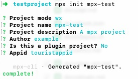
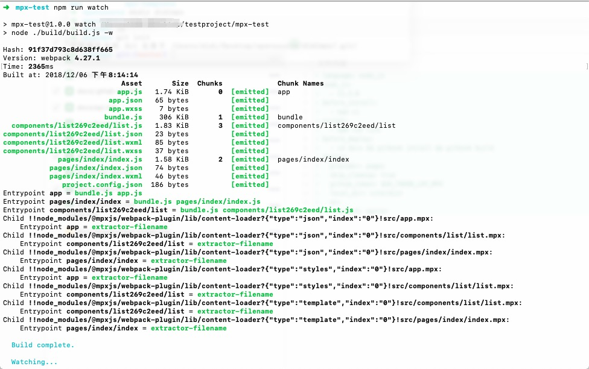

# 开始

使用脚手架`mpx-cli`，快速开始开发mpx小程序
## 安装mpx-cli  
```shell
npm i -g @mpxjs/cli
```

## 创建工程

* 在当前目录中创建工程目录

```shell
mpx create <project-name>
```

`插件项目`由于微信限制必须填写插件的`AppID`，`普通项目`无强制要求。

## mpx编译

启动服务，mpx会将源码编译成小程序识别的代码，并监听文件变化进行重编译

```shell
npm install
npm run serve
```

## 小程序编译
mpx编译完成后，会将小程序代码放置在dist目录

参考小程序官方的[开发指南](https://developers.weixin.qq.com/miniprogram/dev/)进行预览、调试

## 创建App/Page/Component

我们通过createApp、createPage、createComponent（分别对应小程序原生的App、Page、Component方法）来创建小程序、页面、组件。

下面看一个例子：

## 例子

开始一个demo项目的流程。

初始化项目：


接下来：
```bash
# 进入project
cd mpx-demo

# 安装依赖
npm i

# 进行开发
npm run serve
```



用微信开发者工具打开目录 `~/testproject/mpx-test/dist`

在src/app.mpx创建一个App

```html
<script>
  import { createApp } from '@mpxjs/core'
  createApp({
    onShow(options) {
      console.log(options)
    }
  })
</script>

<style lang="stylus">
  page
    font-family: PingFangSC-Regular, PingFang SC, STHeitiSC-Light, Helvetica-Light, arial, sans-serif
</style>

<script type="application/json">
  {
    "pages": [
      "./pages/index/index"
    ],
    "window": {
      "backgroundTextStyle": "light",
      "navigationBarBackgroundColor": "#fff",
      "navigationBarTitleText": "WeChat",
      "navigationBarTextStyle": "black"
    }
  }
</script>

```

在src/pages创建Page

```html
<template>
  <view class="page-container">
    <list></list>
  </view>
</template>

<script>
  import {createPage} from '@mpxjs/core'

  createPage({
    onLoad () {
    }
  })
</script>

<style lang="stylus">
  .page-container
    font: 14px 'Helvetica Neue', Helvetica, Arial, sans-serif
</style>


<script type="application/json">
  {
    "usingComponents": {
      "list": "../../components/list/list"
    }
  }
</script>

```

修改src/component/list/list.mpx的代码：

```html
<template xmlns="">
  <view class="list">
    <!--增强指令 wx:style-->
    <view wx:style="{{listStyle}}" wx:for="{{listData}}">{{item}}</view>
    <!--增强指令 wx:class-->
    <view wx:class="{{isViewClass ? viewClass : ''}}">{{testData}}</view>
    <!--watch question改变answer-->
    <view>{{question}}</view>
    <view>{{answer}}</view>
    <!--增强指令 wx:model，用于双向绑定-->
    <input wx:model="{{model}}"/>
    <input wx:model="{{testModel.model}}"/>
    <input wx:model="{{testModel['model']}}"/>
    <!--动态组件，此处的componentName为json中注册的usingComponents的key值-->
    <component is="{{componentName}}"></component>
  </view>
</template>

<script>
  import {createComponent} from '@mpxjs/core'
  import mixin from './mixin'
  createComponent({
    mixins: [mixin],
    data: {
      model: '我是测试model双向绑定',
      testModel: {
        model: '我是测试model双向绑定'
      },
      listData: {
        'phone': '手机',
        'tv': '电视',
        'computer': '电脑'
      },
      isViewClass: true,
      viewClass: 'white-color',
      listStyle: {
        color: '#fff'
      },
      question: '我是测试watch用的',
      answer: '我也是测试watch用的!',
      componentName: 'testA'
    },
    ready () {
      // mixinTestData来自mixin
      console.log('component ready:', this.mixinTestData.tv)
      setTimeout(() => {
        this.changeData()
        // 可以看到data可直接修改，实现了computed功能。
        this.listData.phone = '110'
        this.componentName = 'testB'
      }, 2000)
    },
    computed: {
      testData () {
        return JSON.stringify(this.listData)
      }
    },
    pageShow () {
      // 所在页面显示之后就会执行一次
      console.log('page show')
    },
    pageHide () {
      // 页面切入后台执行
      console.log('page hide')
    },
    watch: {
      question(newval, oldval) {
        this.answer = '我是测试观察属性watch'
      }
    },
    methods: {
      changeData() {
        this.question = '我是测试观察属性watch'
      }
    }
  })
</script>

<style lang="stylus">
  .list
    background-color red
  .white-color
    color #fff
</style>

<script type="application/json">
  {
    "component": true,
    "usingComponents": {
      "testA": "./testA",
      "testB": "./testB"
    }
  }
</script>

```

更多用法可以看这个todoMVC示例：https://github.com/didi/mpx/tree/master/examples/mpx-todoMVC
