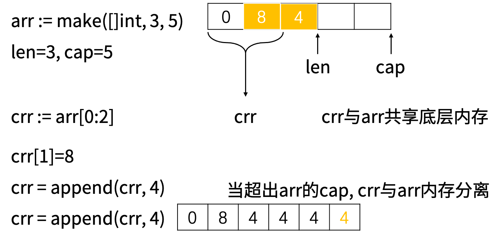

# Go数据类型
## 数据类型概览
基础数据类型
|类型|长度(字节)|默认值|说明|
| :---: | :---: |:---: | :---: |
|bool|1|false||
|byte|1|0|uint8，取值范围[0,255]|
|rune|4|0|Unicode Code Point, int32|
|int, uint|4或8|0|32 或 64 位，取决于操作系统|
|int8, uint8|1|0|-128 ~ 127, 0 ~ 255|
|int16, uint16|2|0|-32768 ~ 32767, 0 ~ 65535|
|int32, uint32|4|0|-21亿~ 21亿, 0 ~ 42亿，rune是int32 的别名|
|int64, uint64|8|0||
|float32|4|0.0||
|float64|8|0.0||
|complex64|8|||
|complex128|16|||
|uintptr|4或8||以存储指针的 uint32 或 uint64 整数|  
```Go
fmt.Printf("os arch %s, int size %d\n", runtime.GOARCH, strconv.IntSize) //int是4字节还是8字节，取决于操作系统是32位还是64位
var a int = 5
var b int8 = 5
var c int16 = 5
var d int32 = 5
var e int64 = 5
var f uint = 5
var g uint8 = 5
var h uint16 = 5
var i uint32 = 5
var j uint64 = 5
fmt.Printf("a=%d, b=%d, c=%d, d=%d, e=%d, f=%d, g=%d, h=%d, i=%d, j=%d\n", a, b, c, d, e, f, g, h, i, j)
var k float32 = 5
var l float64 = 5
fmt.Printf("k=%f, l=%.2f\n", k, l) //%.2f保留2位小数
var m complex128 = complex(4, 7)
var n complex64 = complex(4, 7)
fmt.Printf("type of m is %T, type of n is %T\n", m, n) //%T输出变量类型
fmt.Printf("m=%v, n=%v\n", m, n)                       //按值的本来值输出
fmt.Printf("m=%+v, n=%+v\n", m, n)                     //在 %v 基础上，对结构体字段名和值进行展开
fmt.Printf("m=%#v, n=%#v\n", m, n)                     //输出 Go 语言语法格式的值
fmt.Printf("m的实部%f, m的虚部%f\n", real(m), imag(m))
fmt.Printf("m的实部%e, m的虚部%g\n", real(m), imag(m)) //%e科学计数法，%g根据实际情况采用%e或%f格式（以获得更简洁、准确的输出）
o := true                                        //等价于var o bool = true
fmt.Printf("o=%t\n", o)                          //%t布尔变量
var pointer unsafe.Pointer = unsafe.Pointer(&a)
var p uintptr = uintptr(pointer)
var ptr *int = &a
fmt.Printf("p=%x pointer=%p ptr=%p\n", p, pointer, ptr) //%p输出地址，%x十六进制
var q byte = 100                                        //byte是uint，取值范围[0,255]
fmt.Printf("q=%d, binary of q is %b\n", q, q)           //%b输出二进制
var r rune = '☻'                                        //rune实际上是int32，即可以表示2147483647种字符，包括所有汉字和各种特殊符号
fmt.Printf("r=%d, r=%U\n", r, r)                        //%U Unicode 字符
var s string = "I'm 张朝阳"
fmt.Printf("s=%s\n", s)
var t error = errors.New("my error")
fmt.Printf("error is %v\n", t)
fmt.Printf("error is %+v\n", t) //在 %v 基础上，对结构体字段名和值进行展开
fmt.Printf("error is %#v\n", t) //输出 Go 语言语法格式的值
```
&#8195;&#8195;数值型变量的默认值是0，字符串的默认值是空字符串，布尔型变量的默认值是false，引用类型、函数、指针、接口的默认值是nil。数组的默认值取每个元素对应类型的默认值，结构体的默认值取每个成员变量对应类型的默认值。
```GO
var a int
var b byte
var f float32
var t bool
var s string
var r rune
var arr [3]int
var slc []int

fmt.Printf("default value of int %d\n", a)
fmt.Printf("default value of byte %d\n", b)
fmt.Printf("default value of float %.2f\n", f)
fmt.Printf("default value of bool %t\n", t)
fmt.Printf("default value of string [%s]\n", s)
fmt.Printf("default value of rune %d, [%c]\n", r, r)
fmt.Printf("default int array is %v\n", arr) //取每个元素对应类型的默认值
fmt.Printf("default slice is nil %t\n", slc == nil)

//输出
default value of int 0
default value of byte 0
default value of float 0.00
default value of bool false
default value of string []
default value of rune 0, []
default int array is [0 0 0]
default slice is nil true

```
复合数据类型
|类型|默认值|说明|
| :---: | :---: |:---: |
|array|取每个元素对应类型的默认值|值类型|
|struct|取每个成员变量对应类型的默认值|值类型|
|string|""|UTF-8 字符串|
|slice|nil|引用类型|
|map|nil|引用类型|
|channel|nil|引用类型|
|interface|nil|接口|
|function|nil|函数|
## 自定义类型
类型别名
```Go
type byte = uint8
type rune = int32
type semaphore = uint8
```
自定义类型
```Go
type user struct {name string;age int}  //用分号把多行代码隔开
type signal uint8
type ms map[string]string
type add func(a, b int) int
```
## 数组
&#8195;&#8195;数组是块连续的内存空间，在声明的时候必须指定长度，且长度不能改变。所以数组在声明的时候就可以把内存空间分配好，并赋上默认值，即完成了初始化。  

  

一维数组初始化
```Go
var arr1 [5]int = [5]int{} //数组必须指定长度和类型，且长度和类型指定后不可改变
var arr2 = [5]int{}
var arr3 = [5]int{3, 2} //给前2个元素赋值
var arr4 = [5]int{2: 15, 4: 30} //指定index赋值
var arr5 = [...]int{3, 2, 6, 5, 4}//根据{}里元素的个数推断出数组的长度
var arr6 = [...]struct {
    name string
    age int
}{{"Tom", 18}, {"Jim", 20}} //数组的元素类型由匿名结构体给定
```
二维数组初始化
```Go
//5行3列，只给前2行赋值，且前2行的所有列还没有赋满
var arr1 = [5][3]int{{1}, {2, 3}}
//第1维可以用...推测，第2维不能用...
var arr2 = [...][3]int{{1}, {2, 3}}
```
访问数组里的元素
- 通过index访问
  - 首元素 arr[0]
  - 末元素 arr[len(arr)-1]
- 访问二维数组里的元素
  - 位于第三行第四列的元素 arr[2][3]

遍历数组
```Go
//遍历数组里的元素
for i, ele := range arr {
    fmt.Printf("index=%d, element=%d\n", i, ele)
}
//或者这样遍历数组
for i := 0; i < len(arr); i++ { //len(arr)获取数组的长度
    fmt.Printf("index=%d, element=%d\n", i, arr[i])
}
//遍历二维数组
for row, array := range arr { //先取出某一行
    for col, ele := range array { //再遍历这一行
        fmt.Printf("arr[%d][%d]=%d\n", row, col, ele)
    }
}
```
&#8195;&#8195;通过for range遍历数组时取得的是数组里每一个元素的拷贝。
```Go
arr := [...]int{1, 2, 3}
for i, ele := range arr { //ele是arr中元素的拷贝
    arr[i] += 8 //修改arr里的元素，不影响ele
    fmt.Printf("%d %d %d\n", i, arr[i], ele)
    ele += 1 //修改ele不影响arr
    fmt.Printf("%d %d %d\n", i, arr[i], ele)
}
for i := 0; i < len(arr); i++ {
    fmt.Printf("%d %d\n", i, arr[i])
}
```
在数组上调用cap()函数表示capacity容量，即给数组分配的内存空间可以容纳多少个元素；len()函数代表length长度，即目前数组里有几个元素。由于数组初始化之后长度不会改变，不需要给它预留内存空间，所以len(arr)==cap(arr)。对于多维数组，其cap和len指第一维的长度。
&#8195;&#8195;数组的长度和类型都是数组类型的一部分，函数传递数组类型时这两部分都必须吻合。go语言没有按引用传参，全都是按值传参，即传递数组实际上传的是数组的拷贝，当数组的长度很大时，仅传参开销都很大。如果想修改函数外部的数组，就把它的指针（数组在内存里的地址）传进来。

```Go
//参数必须是长度为5的int型数组（注意长度必须是5）
func update_array1(arr [5]int) {
	fmt.Printf("array in function, address is %p\n", &arr[0])
	arr[0] = 888

}

func update_array2(arr *[5]int) {
	fmt.Printf("array in function, address is %p\n", &((*arr)[0]))
	arr[0] = 888 //因为传的是数组指针，所以直接在原来的内存空间上进行修改
}
```
## 切片
&#8195;&#8195;切片是一个结构体，包含三个成员变量，array指向一块连续的内存空间，cap表示这块内存的大小，len表示目前该内存里存储了多少元素。
```Go
type slice struct { 
    array unsafe.Pointer 
    len int 
    cap int 
}
```
   

切片的初始化
```Go
var s []int //切片声明，len=cap=0
s = []int{} //初始化，len=cap=0
s = make([]int, 3) //初始化，len=cap=3
s = make([]int, 3, 5) //初始化，len=3，cap=5
s = []int{1, 2, 3, 4, 5} //初始化，len=cap=5
s2d := [][]int{
    {1},{2, 3}, //二维数组各行的列数相等，但二维切片各行的len可以不等
}
```
&#8195;&#8195;切片相对于数组最大的特点就是可以追加元素，可以自动扩容。追加的元素放到预留的内存空间里，同时len加1。如果预留空间已用完，则会重新申请一块更大的内存空间，capacity大约变成之前的2倍(cap<1024)或1.25倍(cap>1024)。把原内存空间的数据拷贝过来，在新内存空间上执行append操作。  
```Go
s := make([]int, 3, 5)
for i := 0; i < 3; i++ {
    s[i] = i + 1
} //s=[1,2,3]
fmt.Printf("s[0] address %p, s=%v\n", &s[0], s)
/*
capacity还够用，直接把追加的元素放到预留的内存空间上
*/
s = append(s, 4, 5) //可以一次append多个元素
fmt.Printf("s[0] address %p, s=%v\n", &s[0], s)
/*
capacity不够用了，得申请一片新的内存，把老数据先拷贝过来，在新内存上执行append操作
*/
s = append(s, 6)
fmt.Printf("s[0] address %p, s=%v\n", &s[0], s)
```
```Go
//探究capacity扩容规律
func expansion() {
	s := make([]int, 0, 3)
	prevCap := cap(s)
	for i := 0; i < 100; i++ {
		s = append(s, i)
		currCap := cap(s)
		if currCap > prevCap {
			//每次扩容都是扩到原先的2倍
			fmt.Printf("capacity从%d变成%d\n", prevCap, currCap)
			prevCap = currCap
		}
	}
}
```
&#8195;&#8195;通过指定起止下标，可以从大切片中截取一个子切片。  
```Go
s := make([]int, 3, 5)	//len=3, cap=5
sub_slice = s[1:3]		//len=2, cap=4
```
&#8195;&#8195;刚开始，子切片和母切片共享底层的内存空间，修改子切片会反映到母切片上，在子切片上执行append会把新元素放到母切片预留的内存空间上。当子切片不断执行append，耗完了母切片预留的内存空间，子切片跟母切片就会发生内存分离，此后两个切片没有任何关系。  

 

```Go
func sub_slice() {
	/*
	截取一部分，创造子切片，此时子切片与母切片(或母数组)共享底层内存空间，母切片的capacity子切片可能直接用
	*/
	s := make([]int, 3, 5)
	for i := 0; i < 3; i++ {
		s[i] = i + 1
	} //s=[1,2,3]
	fmt.Printf("s[1] address %p\n", &s[1])
	sub_slice := s[1:3] //从切片创造子切片，len=cap=2
	fmt.Printf("len %d cap %d\n", len(sub_slice), cap(sub_slice))
	/*
	母切片的capacity还允许子切片执行append操作
	*/
	sub_slice = append(sub_slice, 6, 7) //可以一次append多个元素
	sub_slice[0] = 8
	fmt.Printf("s=%v, sub_slice=%v, s[1] address %p, sub_slice[0] address %p\n", s, sub_slice, &s[1], &sub_slice[0])
	/*
	母切片的capacity用完了，子切片再执行append就得申请一片新的内存，把老数据先拷贝过来，在新内存上执行append操作。此时的append操作跟母切片没有任何关系
	*/
	sub_slice = append(sub_slice, 8)
	sub_slice[0] = 9
	fmt.Printf("s=%v, sub_slice=%v, s[1] address %p, sub_slice[0] address %p\n", s, sub_slice, &s[1], &sub_slice[0])

	arr := [5]int{1, 2, 3, 4, 5}
	fmt.Printf("arr[1] address %p\n", &arr[1])
	sub_slice = arr[1:3] //从数组创造子切片，len=cap=2
	fmt.Printf("len %d cap %d\n", len(sub_slice), cap(sub_slice))
	/*
	母数组的capacity还允许子切片执行append操作
	*/
	sub_slice = append(sub_slice, 6, 7) //可以一次append多个元素
	sub_slice[0] = 8
	fmt.Printf("arr=%v, sub_slice=%v, arr[1] address %p, sub_slice[0] address %p\n", arr, sub_slice, &arr[1], &sub_slice[0])
	/*
	母数组的capacity用完了，子切片再执行append就得申请一片新的内存，把老数据先拷贝过来，在新内存上执行append操作。此时的append操作跟母数组没有任何关系
	*/
	sub_slice = append(sub_slice, 8)
	sub_slice[0] = 9
	fmt.Printf("arr=%v, sub_slice=%v, arr[1] address %p, sub_slice[0] address %p\n", arr, sub_slice, &arr[1], &sub_slice[0])
}
```
&#8195;&#8195;go语言函数传参，传的都是值，即传切片会把切片的{arrayPointer, len, cap}这3个字段拷贝一份传进来。由于传的是底层数组的指针，所以可以直接修改底层数组里的元素。  
```Go
func update_slice(s []int) {
	s[0] = 888
}
s := []int{1, 2, 3}
update_slice(s)
fmt.Printf("s=%v\n", s)
```
## 字符串
&#8195;&#8195;字符串里可以包含任意Unicode字符。
```Go
s := " My name is 张朝阳☻" 
```
&#8195;&#8195;字符串里可以包含转义字符。
```Go
s := "He say:\"I'm fine.\" \n\\Thank\tyou.\\" 
```
&#8195;&#8195;字符串也可以用反引号来定义，反引号里的转义字符无效。反引号里的内容原封不动地输出，包括空白符和换行符。
```Go
s := `here is first line. 

  there is third line.
`
```
字符串常用操作
|方法|介绍|
|:---:|:---:|
|len(str)|求长度|
|strings.Split|分割|
|strings.Contains|判断是否包含|
|strings.HasPrefix,strings.HasSuffix|前缀/后缀判断|
|strings.Index(),strings.LastIndex()|子串出现的位置|
```Go
s := "born to win, born to die."
fmt.Printf("sentence length %d\n", len(s))
fmt.Printf("\"s\" length %d\n", len("s"))  //英文字母的长度为1
fmt.Printf("\"中\"  length %d\n", len("中")) //一个汉字占3个长度
arr := strings.Split(s, " ")
fmt.Printf("arr[3]=%s\n", arr[3])
fmt.Printf("contain die %t\n", strings.Contains(s, "die"))          //包含子串
fmt.Printf("contain wine %t\n", strings.Contains(s, "wine"))        //包含子串
fmt.Printf("first index of born %d\n", strings.Index(s, "born"))    //寻找子串第一次出现的位置
fmt.Printf("last index of born %d\n", strings.LastIndex(s, "born")) //寻找子串最后一次出现的位置
fmt.Printf("begin with born %t\n", strings.HasPrefix(s, "born"))    //以xxx开头
fmt.Printf("end with die. %t\n", strings.HasSuffix(s, "die."))      //以xxx结尾
```
&#8195;&#8195;把多个字符串拼接成一个长的字符串有多种方式。
1. 加号连接。
2. func fmt.Sprintf(format string, a ...interface{}) string
3. func strings.Join(elems []string, sep string) string
4. 当有大量的string需要拼接时，用strings.Builder效率最高
```Go
s1 := "Hello"
s2 := "how"
s3 := "are"
s4 := "you"
merged := s1 + " " + s2 + " " + s3 + " " + s4
fmt.Println(merged)
merged = fmt.Sprintf("%s %s %s %s", s1, s2, s3, s4)
fmt.Println(merged)
merged = strings.Join([]string{s1, s2, s3, s4}, " ")
fmt.Println(merged)
//当有大量的string需要拼接时，用strings.Builder效率最高
sb := strings.Builder{}
sb.WriteString(s1)
sb.WriteString(" ")
sb.WriteString(s2)
sb.WriteString(" ")
sb.WriteString(s3)
sb.WriteString(" ")
sb.WriteString(s4)
sb.WriteString(" ")
merged = sb.String()
fmt.Println(merged)
```
&#8195;&#8195;string中每个元素叫“字符”，字符有两种：
1. byte：1个字节， 代表ASCII码的一个字符。
2. rune：4个字节，代表一个UTF-8字符，一个汉字可用一个rune表示。

&#8195;&#8195;string是常量，不能修改其中的字符。  
&#8195;&#8195;string可以转换为[]byte或[]rune类型。  
&#8195;&#8195;string底层是byte数组，string的长度就是该byte数组的长度， UTF-8编码下一个汉字占3个byte，即一个汉字占3个长度。
```Go
s1 := "My name is 张朝阳"
arr := []byte(s1)
brr := []rune(s1)
fmt.Printf("last byte %d\n", arr[len(arr)-1]) //string可以转换为[]byte或[]rune类型
fmt.Printf("last byte %c\n", arr[len(arr)-1]) //byte或rune可以转为string
fmt.Printf("last rune %d\n", brr[len(brr)-1])
fmt.Printf("last rune %c\n", brr[len(brr)-1])
L := len(s1)
fmt.Printf("string len %d byte array len %d rune array len %d\n", L, len(arr), len(brr))
for _, ele := range s1 {
    fmt.Printf("%c ", ele) //string中的每个元素是字符
}
fmt.Println()
for i := 0; i < L; i++ {
    fmt.Printf("%c ", s1[i]) //[i]前面应该出现数组或切片，这里自动把string转成了[]byte（而不是[]rune）
}
```
## 数据类型转换
&#8195;&#8195;强制类型转换的基本方法就是把目标类型放在变量前面，把变量括起来。
```Go
var i int = 9
var by byte = byte(i)		//int转为byte
i = int(by)		//byte转为int
```
- 低精度向高精度转换没问题，高精度向低精度转换会丢失位数。
- 无符号向有符号转换，最高位是符号位。
- byte和int可以互相转换。
- float和int可以互相转换，小数位会丢失。
- bool和int不能相互转换。
- 不同长度的int或float之间可以相互转换。
```Go
//高精度向低精度转换，数字很小时这种转换没问题
var ua uint64 = 1
i8 := int8(ua)
fmt.Printf("i8=%d\n", i8)

//最高位的1变成了符号位
ua = uint64(math.MaxUint64)
i64 := int64(ua)
fmt.Printf("i64=%d\n", i64)

//位数丢失
ui32 := uint32(ua)
fmt.Printf("ui32=%d\n", ui32)

//单个字符可以转为int
var i int = int('a')
fmt.Printf("i=%d\n", i)

//bool和int不能相互转换

//byte和int可以互相转换
var by byte = byte(i)
i = int(by)
fmt.Printf("i=%d\n", i)

//float和int可以互相转换，小数位会丢失
var ft float32 = float32(i)
i = int(ft)
fmt.Printf("i=%d\n", i)
```
string和其他数据类型互转。
```Go
var err error
var i int = 8
var i64 int64 = int64(i)
//int转string
var s string = strconv.Itoa(i) //内部调用FormatInt
s = strconv.FormatInt(i64, 10)
//string转int
i, err = strconv.Atoi(s)
//string转int64
i64, err = strconv.ParseInt(s, 10, 64)

//float转string
var f float64 = 8.123456789
s = strconv.FormatFloat(f, 'f', 2, 64) //保留2位小数
fmt.Println(s)
//string转float
f, err = strconv.ParseFloat(s, 64)

//string<-->[]byte
var arr []byte = []byte(s)
s = string(arr)

//string<-->[]rune
var brr []rune = []rune(s)
s = string(brr)

fmt.Printf("err %v\n", err)
```
## map
&#8195;&#8195;go map的底层实现是hash table，根据key查找value的时间复杂度是O(1)。  

   

map的初始化
```Go
var m map[string]int //声明map，指定key和value的数据类型
m = make(map[string]int) //初始化，容量为0
m = make(map[string]int, 200) //初始化，容量为5。强烈建议初始化时给一个合适的容量，减少扩容的概率
m = map[string]int{"语文": 0, "数学": 39} //初始化时直接赋值
```
添加和删除key
```Go
m["英语"] = 59 //往map里添加key-value对
m ["英语"] = 70 //会覆盖之前的值
delete(m, "数学") //从map里删除key-value对
```
&#8195;&#8195;len(m)获取map的长度，go不支持对map上执行cap函数。  
&#8195;&#8195;读取key对应的value时，如果key不存在，则返回value类型的默认值，所以强烈建议先判断key是否存在。

```Go
if value, exists := m["语文"]; exists {
    fmt.Println(value)
} else {
    fmt.Println("map里不存在[语文]这个key")
}
```
遍历map
```Go
//遍历map
for key, value := range m {
    fmt.Printf("%s=%d\n", key, value)
}
fmt.Println("-----------")
//多次遍历map返回的顺序是不一样的，但相对顺序是一样的，因为每次随机选择一个开始位置，然后顺序遍历
for key, value := range m {
    fmt.Printf("%s=%d\n", key, value)
}
fmt.Println("-----------")

//一边遍历一边修改
for key, value := range m {
    m[key] = value + 1
}
for key, value := range m {
    fmt.Printf("%s=%d\n", key, value)
}
fmt.Println("-----------")

//for range取得的是值拷贝
for _, value := range m {
    value = value + 1
}
for key, value := range m {
    fmt.Printf("%s=%d\n", key, value)
}
```
&#8195;&#8195;map中的key可以是任意能够用==操作符比较的类型，不能是函数、map、切片，以及包含上述3中类型成员变量的的struct。map的value可以是任意类型。  
```Go
type f func(int) bool
type m map[int]byte
type s []int

type i int

var m1 map[i]f
fmt.Println(m1)

/** 函数、map、切片不能当key **/
// var m2 map[f]bool
// fmt.Println(m2)
// var m3 map[m]bool
// fmt.Println(m3)
// var m4 map[s]bool
// fmt.Println(m4)

type user struct {
	scores float32 //如果scores是slice，则user不能作为map的key
}

u := user{}
m5 := make(map[user]interface{})
m5[u] = 5
fmt.Println(m5)
```
## channel
&#8195;&#8195;channel(管道)底层是一个环形队列(先进先出)，send(插入)和recv(取走)从同一个位置沿同一个方向顺序执行。sendx表示最后一次插入元素的位置，recvx表示最后一次取走元素的位置。  
  

```Go
var ch chan int //管道的声明
ch = make(chan int, 8) //管道的初始化，环形队列里可容纳8个int
ch <- 1                //往管道里写入(send)数据
ch <- 2
ch <- 3
ch <- 4
ch <- 5
v := <-ch //从管道里取走(recv)数据
fmt.Println(v)
v = <-ch
fmt.Println(v)
```
```Go
read_only := make (<-chan int)   //定义只读的channel
write_only := make (chan<- int)   //定义只写的channel
```
&#8195;&#8195;定义只读和只写的channel意义不大，一般用于在参数传递中。  
```Go
//只能向channel里写数据 
func send(c chan<- int) { 
    c <- 1 
} 

//只能取channel中的数据 
func recv(c <-chan int) {
	_ = <-c
}

//返回一个只读channel
func (c *Context) Done() <-chan struct{} {
    return nil
}
```
&#8195;&#8195;可以通过for range的方式遍历管道，遍历前必须先关闭管道，禁止再写入元素。
```Go
close(ch) //遍历前必须先关闭管道，禁止再写入元素
//遍历管道里剩下的元素
for ele := range ch {
    fmt.Println(ele)
}
```
&#8195;&#8195;slice、map和channel是go语言里的3种引用类型，都可以通过make函数来进行初始化（申请内存分配）。因为它们都包含一个指向底层数据结构的指针，所以称之为“引用”类型。引用类型未初始化时都是nil，可以对它们执行len()函数，返回0。