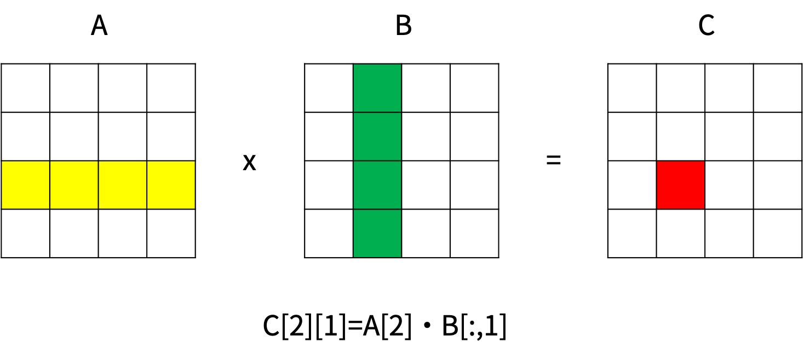

# 流程控制语句
## if
```Go
if 5 > 9 {
    fmt.Println("5>9")
}
```
- 如果逻辑表达式成立，就会执行{}里的内容。
- 逻辑表达式不需要加()。
- "{"必须紧跟在逻辑表达式后面，不能另起一行。
```Go
if c, d, e := 5, 9, 2; c < d && (c > e || c > 3) { //初始化多个局部变量。复杂的逻辑表达式
    fmt.Println("fit")
}
```
- 逻辑表达中可以含有变量或常量。
- if句子中允许包含1个(仅1个)分号，在分号前初始化一些局部变量(即只在if块内可见)。  

if-else的用法  
```Go
color := "black"
if color == "red" { //if只能有一个
    fmt.Println("stop")
} else if color == "green" {
    fmt.Println("go")
} else if color == "yellow" { //else if可以有0个、一个或者连续多个
    fmt.Println("stop")
} else { //else有0个或1个
    fmt.Printf("invalid traffic signal: %s\n", strings.ToUpper(color))
}
```
if表达式嵌套  
```Go
if xxx {
    if xxx {
    }else if xxx{
    }else{
    }
}else{
    if xxx {
    }else{
    }
}
```
&#8195;&#8195;注意太深的嵌套不利于代码的维护，比如
```Go
if (true) {
    if (true) {
        if (true) {
            if (true) {
                if (true) {
                }
            }
        }
    }
}
```
## switch
```Go
color := "black"
switch color {
case "green" :	//相当于  if color== "green"
	fmt.Println("go")
case "red" :		//相当于else if color== "red" 
	fmt.Println("stop")
default:		 //相当于else 
	fmt.Printf("invalid traffic signal: %s\n", strings.ToUpper(color))
}
```
- switch-case-default可能模拟if-else if-else，但只能实现相等判断。
- switch和case后面可以跟常量、变量或函数表达式，只要它们表示的数据类型相同就行。
- case后面可以跟多个值，只要有一个值满足就行。
```Go
func add(a int) int {
	return a + 10
}

func switch_expression() {
	var a int = 5
	switch add(a) { //switch后跟一个函数表达式
	case 15: //case后跟一个常量
		fmt.Println("right")
	default:
		fmt.Println("wrong")
	}

	const B = 15
	switch B { //switch后跟一个常量
	case add(a): //case后跟一个函数表达式
		fmt.Println("right")
	default:
		fmt.Println("wrong")
	}
}
```
&#8195;&#8195;switch后带表达式时，switch-case只能模拟相等的情况；如果switch后不带表达式，case后就可以跟任意的条件表达式。  
```Go
func switch_condition() {
	color := "yellow"
	switch color {
	case "green":
		fmt.Println("go")
	case "red", "yellow": //用逗号分隔多个condition，它们之间是“或”的关系，只需要有一个condition满足就行
		fmt.Println("stop")
	}

	//switch后带表达式时，switch-case只能模拟相等的情况；如果switch后不带表达式，case后就可以跟任意的条件表达式
	switch {
	case add(5) > 10:
		fmt.Println("right")
	default:
		fmt.Println("wrong")
	}
}
```
switch Type
```Go
func switch_type() {
	var num interface{} = 6.5
	switch num.(type) { //获取interface的具体类型。.(type)只能用在switch后面
	case int:
		fmt.Println("int")
	case float32:
		fmt.Println("float32")
	case float64:
		fmt.Println("float64")
	case byte:
		fmt.Println("byte")
	default:
		fmt.Println("neither")
	}

	switch value := num.(type) { //相当于在每个case内部申明了一个变量value
	case int: //value已被转换为int类型
		fmt.Printf("number is int %d\n", value)
	case float64: //value已被转换为float64类型
		fmt.Printf("number is float64 %f\n", value)
	case byte, string: //如果case后有多个类型，则value还是interface{}类型
		fmt.Printf("number is inerface %v\n", value)
	default:
		fmt.Println("neither")
	}

	//等价形式
	switch num.(type) {
	case int:
		value := num.(int)
		fmt.Printf("number is int %d\n", value)
	case float64:
		value := num.(float64)
		fmt.Printf("number is float64 %f\n", value)
	case byte:
		value := num.(byte)
		fmt.Printf("number is byte %d\n", value)
	default:
		fmt.Println("neither")
	}
}
```
fallthrough，当命中某一个case时，强行进入下一个case。
```Go
func fall_throth(age int) {
	fmt.Printf("您的年龄是%d, 您可以：\n", age)
	switch {
	case age > 50:
		fmt.Println("出任国家首脑")
		fallthrough
	case age > 25:
		fmt.Println("生育子女")
		fallthrough
	case age > 22:
		fmt.Println("结婚")
		fallthrough
	case age > 38:
		fmt.Println("开车")
		fallthrough
	case age > 16:
		fmt.Println("参加工作")
	case age > 15:
		fmt.Println("上高中")
		fallthrough
	case age > 3:
		fmt.Println("上幼儿园")
	}
}
```
## for
```Go
arr := []int{1, 2, 3, 4, 5}
for i := 0; i < len(arr); i++ { //正序遍历切片
	fmt.Printf("%d: %d\n", i, arr[i])
}
```
for 初始化局部变量;条件表达式;后续操作
```Go
for sum, i := 0, 0; i < len(arr) && sum < 100; sum, i = sum*1, i+1
```
- 局部变量指仅在for块内可见。
- 初始化变量可以放在for上面。
- 后续操作可以放在for块内部。
- 只有条件判断时，前后的分号可以不要。
- for{}是一个无限循环。  

for range  
- 遍历数组或切片
    - for i, ele := range arr 
- 遍历string
    - for i, ele := range "我会唱ABC"	//ele是rune类型
- 遍历map，go不保证遍历的顺序
    - for key, value := range m
- 遍历channel，遍历前一定要先close
    - for ele := range ch
    - for range拿到的是数据的拷贝

for嵌套
&#8195;&#8195;矩阵乘法需要用到三层for循环嵌套。 

   

```Go
func nest_for() {
	const SIZE = 4

	A := [SIZE][SIZE]float64{}
	//初始化二维数组
	//两层for循环嵌套
	for i := 0; i < SIZE; i++ {
		for j := 0; j < SIZE; j++ {
			A[i][j] = rand.Float64() //[0,1)上的随机数
		}
	}

	B := [SIZE][SIZE]float64{}
	for i := 0; i < SIZE; i++ {
		for j := 0; j < SIZE; j++ {
			B[i][j] = rand.Float64() //[0,1)上的随机数
		}
	}

	rect := [SIZE][SIZE]float64{}
	//三层for循环嵌套
	for i := 0; i < SIZE; i++ {
		for j := 0; j < SIZE; j++ {
			prod := 0.0
			for k := 0; k < SIZE; k++ {
				prod += A[i][k] * B[k][j]
			}
			rect[i][j] = prod
		}
	}

	i, j := 2, 1
	fmt.Println(A[i]) //二维数组第i行
	//打印二维数组的第j列
	//注意：B[:][j]这不是二维数组第j列，这是二维数组第j行！
	for _, row := range B {
		fmt.Printf("%g ", row[j])
	}
	fmt.Println()
	fmt.Println(rect[i][j])
}
```
## break与continue
- break与continue用于控制for循环的代码流程，并且只针对最靠近自己的外层for循环。
- break:退出for循环，且本轮break下面的代码不再执行。
- continue:本轮continue下面的代码不再执行，进入for循环的下一轮。

```Go
//break和continue都是针对for循环的，不针对if或switch
//break和continue都是针对套在自己外面的最靠里的那层for循环，不针对更外层的for循环（除非使用Label）
func complex_break_continue() {
	const SIZE = 5
	arr := [SIZE][SIZE]int{}
	for i := 0; i < SIZE; i++ {
		fmt.Printf("开始检查第%d行\n", i)
		if i%2 == 1 {
			for j := 0; j < SIZE; j++ {
				fmt.Printf("开始检查第%d列\n", j)
				if arr[i][j]%2 == 0 {
					continue //针对第二层for循环
				}
				fmt.Printf("将要检查第%d列\n", j+1)
			}
			break //针对第一层for循环
		}
	}
}
```
## goto与Label
```Go
var i int = 4
MY_LABEL:
	i += 3
	fmt.Println(i)
	goto MY_LABEL //返回定义MY_LABEL的那一行，把代码再执行一遍（会进入一个无限循环）
```
```Go
if i%2 == 0 {
	goto L1 //Label指示的是某一行代码，并没有圈定一个代码块，所以goto L1也会执行L2后的代码
} else {
	goto L2//先使用Label
}
L1: 
	i += 3
L2: //后定义Label。Label定义后必须在代码的某个地方被使用
	i *= 3
```
&#8195;&#8195;goto与Label结合可以实现break的功能，甚至比break更强大。  
```Go
for i := 0; i < SIZE; i++ {
L2:
for j := 0; j < SIZE; j++ {
	goto L1
}
}
L1:
xxx
```
- break、continue与Label结合使用可以跳转到更外层的for循环。
- continue和break针对的Label必须写在for前面，而goto可以针对任意位置的Label。

```Go
func break_label() {
	const SIZE = 5
	arr := [SIZE][SIZE]int{}
L1:
	for i := 0; i < SIZE; i++ {
	L2:
		fmt.Printf("开始检查第%d行\n", i)

		if i%2 == 1 {
		L3:
			for j := 0; j < SIZE; j++ {
				fmt.Printf("开始检查第%d列\n", j)
				if arr[i][j]%3 == 0 {
					break L1 //直接退出最外层的fot循环
				} else if arr[i][j]%3 == 1 {
					goto L2 //continue和break针对的Label必须写在for前面，而goto可以针对任意位置的Label
				} else {
					break L3
				}
			}
		}
	}
}
```