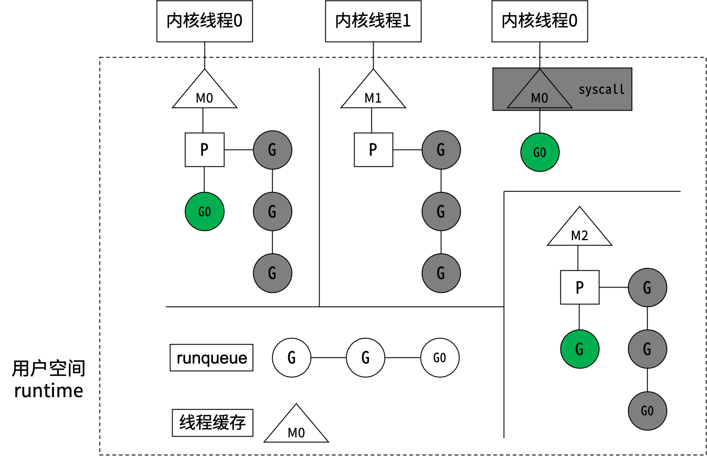

# 并发编程
## 并发模型
&#8195;&#8195;任何语言的并行，到操作系统层面，都是内核线程的并行。同一个进程内的多个线程共享系统资源，进程的创建、销毁、切换比线程大很多。从进程到线程再到协程, 其实是一个不断共享, 不断减少切换成本的过程。  
  
  
  
|  |协程|线程|
|:--:|:-|:-|
|创建数量|轻松创建上百万个协程而不会导致系统资源衰竭|通常最多不能超过1万个|
|内存占用|初始分配4k堆栈，随着程序的执行自动增长删除|创建线程时必须指定堆栈且是固定的，通常以M为单位|
|切换成本|协程切换只需保存三个寄存器，耗时约200纳秒|线程切换需要保存几十个寄存器，耗时约1000纳秒|
|调度方式|非抢占式，由Go runtime主动交出控制权（对于开发者而言是抢占式）|在时间片用完后，由 CPU 中断任务强行将其调度走，这时必须保存很多信息|
|创建销毁|goroutine因为是由Go runtime负责管理的，创建和销毁的消耗非常小，是用户级的|创建和销毁开销巨大，因为要和操作系统打交道，是内核级的，通常解决的办法就是线程池|  

查看逻辑核心数
```Go
fmt.Println(runtime.NumCPU())
```
Go语言的MPG并发模型  
   
&#8195;&#8195;M(Machine)对应一个内核线程。P(Processor)虚拟处理器，代表M所需的上下文环境，是处理用户级代码逻辑的处理器。P的数量由环境变量中的GOMAXPROCS决定，默认情况下就是核数。G(Goroutine)本质上是轻量级的线程，G0正在执行，其他G在等待。M和内核线程的对应关系是确定的。G0阻塞(如系统调用)时，P与G0、M0解绑，P被挂到其他M上，然后继续执行G队列。G0解除阻塞后，如果有空闲的P，就绑定M0并执行G0；否则G0进入全局可运行队列(runqueue)。P会周期性扫描全局runqueue，使上面的G得到执行；如果全局runqueue为空，就从其他P的等待队列里偷一半G过来。  
 

## Goroutine的使用
&#8195;&#8195;启动协程的两种常见方式：  
```Go
func Add(a, b int) int {
    fmt.Println("Add")
    return a + b
}
go Add(2, 4)
```
```Go
go func(a, b int) int {
	fmt.Println("add")
	return a + b
}(2, 4)
```
&#8195;&#8195;优雅地等子协程结束:  
```Go
wg := sync.WaitGroup{}
wg.Add(10) //加10
for i := 0; i < 10; i++ {
	go func(a, b int) { //开N个子协程
		defer wg.Done() //减1
		//do something
	}(i, i+1)
}
wg.Wait() //等待减为0
```
&#8195;&#8195;父协程结束后，子协程并不会结束。main协程结束后，所有协程都会结束。  
向协程内传递变量
```Go
package main

import (
	"fmt"
	"time"
)

func main() {
	arr := []int{1, 2, 3, 4}
	for _, v := range arr {
		go func() {
			fmt.Printf("%d\t", v) //用的是协程外面的全局变量v。输出4 4 4 4
		}()
	}
	time.Sleep(time.Duration(1) * time.Second)
	fmt.Println()
	for _, v := range arr {
		go func(value int) {
			fmt.Printf("%d\t", value) //输出1 4 2 3
		}(v) //把v的副本传到协程内部
	}
	time.Sleep(time.Duration(1) * time.Second)
	fmt.Println()
}
```
&#8195;&#8195;有时候需要确保在高并发的场景下有些事情只执行一次，比如加载配置文件、关闭管道等。  
```Go
var resource map[string]string
var loadResourceOnce sync.Once func LoadResource() {
	loadResourceOnce.Do(func() {
		resource["1"] = "A"
	})
}
```
单例模式
```Go
type Singleton struct {}
var singleton *Singleton
var singletonOnce sync.Once
func GetSingletonInstance() *Singleton {
	singletonOnce.Do(func() {
		singleton = &Singleton{}
	})
	return singleton
}
```
&#8195;&#8195;何时会发生panic:  
- 运行时错误会导致panic，比如数组越界、除0。
- 程序主动调用panic(error)。  

&#8195;&#8195;panic会执行什么：
1. 逆序执行当前goroutine的defer链（recover从这里介入）。
2. 打印错误信息和调用堆栈。
3. 调用exit(2)结束整个进程。  

关于defer  
- defer在函数退出前被调用，注意不是在代码的return语句之前执行，因为return语句不是原子操作。
- 如果发生panic，则之后注册的defer不会执行。
- defer服从先进后出原则，即一个函数里如果注册了多个defer，则按注册的逆序执行。
- defer后面可以跟一个匿名函数。
```Go
func goo(x int) int {
	fmt.Printf("x=%d\n", x)
	return x
}

func foo(a, b int, p bool) int {
	c := a*3 + 9
	//defer是先进后出，即逆序执行
	defer fmt.Println("first defer")
	d := c + 5
	defer fmt.Println("second defer")
	e := d / b //如果发生panic，则后面的defer不会执行
	if p {
		panic(errors.New("my error")) //主动panic
	}
	defer fmt.Println("third defer")
	return goo(e) //defer是在函数临退出前执行，不是在代码的return语句之前执行，因为return语句不是原子操作
}
```
&#8195;&#8195;recover会阻断panic的执行。  
```go
func soo(a, b int) {
	defer func() {
		//recover必须在defer中才能生效
		if err := recover(); err != nil {			
            fmt.Printf("soo函数中发生了panic:%s\n", err)
		}
	}()
	panic(errors.New("my error"))
}
```
## Channel的同步与异步
&#8195;&#8195;很多语言通过共享内存来实现线程间的通信，通过加锁来访问共享数据，如数组、map或结构体。go语言也实现了这种并发模型。  
   

&#8195;&#8195;CSP(communicating sequential processes)讲究的是“以通信的方式来共享内存”，在go语言里channel是这种模式的具体实现。  
  

异步管道
```go
asynChann := make(chan int, 8)
```
&#8195;&#8195;channel底层维护一个环形队列（先进先出），make初始化时指定队列的长度。队列满时，写阻塞；队列空时，读阻塞。sendx指向下一次写入的位置， recvx指向下一次读取的位置。 recvq维护因读管道而被阻塞的协程，sendq维护因写管道而被阻塞的协程。  
   

&#8195;&#8195;同步管道可以认为队列容量为0，当读协程和写协程同时就绪时它们才会彼此帮对方解除阻塞。  
```go
syncChann := make(chan int)
```
&#8195;&#8195;channel仅作为协程间同步的工具，不需要传递具体的数据，管道类型可以用struct{}。空结构体变量的内存占用为0，因此struct{}类型的管道比bool类型的管道还要省内存。  
```go
sc := make(chan struct{})
sc <- struct{}{}
```
关于channel的死锁与阻塞
1. Channel满了，就阻塞写；Channel空了，就阻塞读。
2. 阻塞之后会交出cpu，去执行其他协程，希望其他协程能帮自己解除阻塞。
3. 如果阻塞发生在main协程里，并且没有其他子协程可以执行，那就可以确定“希望永远等不来”，自已把自己杀掉，报一个fatal error:deadlock出来。
4. 如果阻塞发生在子协程里，就不会发生死锁，因为至少main协程是一个值得等待的“希望”，会一直等（阻塞）下去。
```go
package main

import (
	"fmt"
	"time"
)

func main() {
	ch := make(chan struct{}, 1)
	ch <- struct{}{} //有1个缓冲可以用，无需阻塞，可以立即执行
	go func() {      //子协程1
		time.Sleep(5 * time.Second) //sleep一个很长的时间
		<-ch                        //如果把本行代码注释掉，main协程5秒钟后会报fatal error
		fmt.Println("sub routine 1 over")
	}()

	ch <- struct{}{} //由于子协程1已经启动，寄希望于子协程1帮自己解除阻塞，所以会一直等子协程1执行结束。如果子协程1执行结束后没帮自己解除阻塞，则希望完全破灭，报出deadlock
	fmt.Println("send to channel in main routine")
	go func() { //子协程2
		time.Sleep(2 * time.Second)
		ch <- struct{}{} //channel已满，子协程2会一直阻塞在这一行
		fmt.Println("sub routine 2 over")
	}()
	time.Sleep(3 * time.Second)
	fmt.Println("main routine exit")
}
```
关闭channel
- 只有当管道关闭时，才能通过range遍历管道里的数据，否则会发生fatal error。
- 管道关闭后读操作会立即返回，如果缓冲已空会返回“0值”。
- ele, ok := <-ch  	ok==true代表ele是管道里的真实数据。
- 向已关闭的管道里send数据会发生panic。
- 不能重复关闭管道，不能关闭值为nil的管道，否则都会panic。
```go
package main

import (
	"fmt"
	"time"
)

var cloch = make(chan int, 1)
var cloch2 = make(chan int, 1)

func traverseChannel() {
	for ele := range cloch {
		fmt.Printf("receive %d\n", ele)
	}
	fmt.Println()
}

func traverseChannel2() {
	for {
		if ele, ok := <-cloch2; ok { //ok==true代表管道还没有close
			fmt.Printf("receive %d\n", ele)
		} else { //管道关闭后，读操作会立即返回“0值”
			fmt.Printf("channel have been closed, receive %d\n", ele)
			break
		}
	}
}

func main() {
	cloch <- 1
	close(cloch)
	traverseChannel() //如果不close就直接通过range遍历管道，会发生fatal error: all goroutines are asleep - deadlock!
	fmt.Println("==================")
	go traverseChannel2()
	cloch2 <- 1
	close(cloch2)
	time.Sleep(10 * time.Millisecond)
}
```
&#8195;&#8195;channel在并发编程中有多种玩法，经常用channel来实现协程间的同步。  


```go
package main

import (
	"fmt"
	"time"
)

func upstream(ch chan struct{}) {
	time.Sleep(15 * time.Millisecond)
	fmt.Println("一个上游协程执行结束")
	ch <- struct{}{}
}

func downstream(ch chan struct{}) {
	<-ch
	fmt.Println("下游协程开始执行")
}

func main() {
	upstreamNum := 4   //上游协程的数量
	downstreamNum := 5 //下游协程的数量

	upstreamCh := make(chan struct{}, upstreamNum)
	downstreamCh := make(chan struct{}, downstreamNum)

	//启动上游协程和下游协程，实际下游协程会先阻塞
	for i := 0; i < upstreamNum; i++ {
		go upstream(upstreamCh)
	}
	for i := 0; i < downstreamNum; i++ {
		go downstream(downstreamCh)
	}

	//同步点
	for i := 0; i < upstreamNum; i++ {
		<-upstreamCh
	}

	//通过管道让下游协程开始执行
	for i := 0; i < downstreamNum; i++ {
		downstreamCh <- struct{}{}
	}

	time.Sleep(10 * time.Millisecond) //等下游协程执行结束
}
```
## 并发安全性
&#8195;&#8195;多协程并发修改同一块内存，产生资源竞争。go run或go build时添加-race参数检查资源竞争情况。  
&#8195;&#8195;n++不是原子操作，并发执行时会存在脏写。n++分为3步：取出n，加1，结果赋给n。测试时需要开1000个并发协程才能观察到脏写。  


```Go
func atomic.AddInt32(addr *int32, delta int32) (new int32)
func atomic.LoadInt32(addr *int32) (val int32)
```
&#8195;&#8195;把n++封装成原子操作，解除资源竞争，避免脏写。  
```Go
var lock sync.RWMutex		//声明读写锁，无需初始化
lock.Lock() lock.Unlock()	//加写锁和释放写锁
lock.RLock() lock.RUnlock()	//加读锁和释放读锁
```
&#8195;&#8195;任意时刻只可以加一把写锁，且不能加读锁。没加写锁时，可以同时加多把读锁，读锁加上之后不能再加写锁。  
```Go
package main

import (
	"fmt"
	"sync"
	"sync/atomic"
)

var n int32 = 0
var lock sync.RWMutex

func inc1() {
	n++ //n++不是原子操作，它分为3步：取出n，加1，结果赋给n
}

func inc2() {
	atomic.AddInt32(&n, 1) //封装成原子操作
}

func inc3() {
	lock.Lock()   //加写锁
	n++           //任一时刻，只有一个协程能进入临界区域
	lock.Unlock() //释放写锁
}

func main() {
	const P = 1000 //开大量协程才能把脏写问题测出来
	wg := sync.WaitGroup{}
	wg.Add(P)
	for i := 0; i < P; i++ {
		go func() {
			defer wg.Done()
			inc1()
		}()
	}
	wg.Wait()
	fmt.Printf("finally n=%d\n", n) //多运行几次，n经常不等于1000
	fmt.Println("===========================")
	n = 0 //重置n
	wg = sync.WaitGroup{}
	wg.Add(P)
	for i := 0; i < P; i++ {
		go func() {
			defer wg.Done()
			inc2()
		}()
	}
	wg.Wait()
	fmt.Printf("finally n=%d\n", atomic.LoadInt32(&n))
	fmt.Println("===========================")
	n = 0 //重置n
	wg = sync.WaitGroup{}
	wg.Add(P)
	for i := 0; i < P; i++ {
		go func() {
			defer wg.Done()
			inc3()
		}()
	}
	wg.Wait()
	lock.RLock() //加读锁。当写锁被其他协程持有时，加读锁操作将被阻塞；否则，如果其他协程持有读锁，加读锁操作不会被阻塞
	fmt.Printf("finally n=%d\n", n)
	lock.RUnlock() //释放读锁
	fmt.Println("===========================")
}
```
&#8195;&#8195;数组、slice、struct允许并发修改（可能会脏写），并发修改map有时会发生panic。如果需要并发修改map请使用sync.Map。  
```Go
package main

import (
	"fmt"
	"sync"
)

type Student struct {
	Name string
	Age  int32
}

var arr = [10]int{}
var m = sync.Map{}

func main() {
	wg := sync.WaitGroup{}
	wg.Add(2)
	go func() { //写偶数位
		defer wg.Done()
		for i := 0; i < len(arr); i += 2 {
			arr[i] = 0
		}
	}()
	go func() { //写奇数位
		defer wg.Done()
		for i := 1; i < len(arr); i += 2 {
			arr[i] = 1
		}
	}()
	wg.Wait()
	fmt.Println(arr) //输出[0 1 0 1 0 1 0 1 0 1]
	fmt.Println("=======================")
	wg.Add(2)
	var stu Student
	go func() {
		defer wg.Done()
		stu.Name = "Fred"
	}()
	go func() {
		defer wg.Done()
		stu.Age = 20
	}()
	wg.Wait()
	fmt.Printf("%s %d\n", stu.Name, stu.Age)
	fmt.Println("=======================")
	wg.Add(2)
	go func() {
		defer wg.Done()
		m.Store("k1", "v1")
	}()
	go func() {
		defer wg.Done()
		m.Store("k1", "v2")
	}()
	wg.Wait()
	fmt.Println(m.Load("k1"))
}
```
## 多路复用
&#8195;&#8195;操作系统级的I/O模型有：
- 阻塞I/O
- 非阻塞I/O
- 信号驱动I/O
- 异步I/O
- 多路复用I/O  
&#8195;&#8195;Linux下，一切皆文件。包括普通文件、目录文件、字符设备文件（键盘、鼠标）、块设备文件（硬盘、光驱）、套接字socket等等。文件描述符（File descriptor，FD）是访问文件资源的抽象句柄，读写文件都要通过它。文件描述符就是个非负整数，每个进程默认都会打开3个文件描述符：0标准输入、1标准输出、2标准错误。由于内存限制，文件描述符是有上限的，可通过ulimit –n查看，文件描述符用完后应及时关闭。    

阻塞I/O  

  

非阻塞I/O  

 

&#8195;&#8195;read和write默认是阻塞模式。    
```C
ssize_t read(int fd, void *buf, size_t count); 
ssize_t write(int fd, const void *buf, size_t nbytes);
```
&#8195;&#8195;通过系统调用fcntl可将文件描述符设置成非阻塞模式。  
```C
int flags = fcntl(fd, F_GETFL, 0); 
fcntl(fd, F_SETFL, flags | O_NONBLOCK);
```

多路复用I/O  
&#8195;&#8195;select系统调用可同时监听1024个文件描述符的可读或可写状态。poll用链表存储文件描述符，摆脱了1024的上限。各操作系统实现了自己的I/O多路复用函数，如epoll、 evport 和kqueue等。  

 

 

&#8195;&#8195;go多路复用函数以netpoll为前缀，针对不同的操作系统做了不同的封装，以达到最优的性能。在编译go语言时会根据目标平台选择特定的分支进行编译。  

 

&#8195;&#8195;利用go channel的多路复用实现倒计时发射的demo。

 

```Go
package main

import (
	"fmt"
	"os"
	"time"
)

//倒计时
func countDown(countCh chan int, n int, finishCh chan struct{}) {
	if n <= 0 { //从n开始倒数
		return
	}
	ticker := time.NewTicker(1 * time.Second) //创建一个周期性的定时器，每隔1秒执行一次
	for {
		countCh <- n //把n放入管道
		<-ticker.C   //等1秒钟
		n--          //n减1
		if n <= 0 {  //n减到0时退出
			ticker.Stop()          //停止定时器
			finishCh <- struct{}{} //成功结束
			break                  //退出for循环
		}
	}
}

//中止
func abort(ch chan struct{}) {
	buffer := make([]byte, 1)
	os.Stdin.Read(buffer) //阻塞式IO，如果标准输入里没数据，该行一直阻塞。注意在键盘上敲完后要按下Enter才会把输入发给Stdin
	ch <- struct{}{}
}

func main() {
	countCh := make(chan int)
	finishCh := make(chan struct{})
	go countDown(countCh, 10, finishCh) //开一个子协程，去往countCh和finishCh里放数据
	abortCh := make(chan struct{})
	go abort(abortCh) //开一个子协程，去往abortCh里放数据

LOOP:
	for { //循环监听
		select { //同时监听3个channel，谁先准备好就执行谁，然后进入下一次for循环
		case n := <-countCh:
			fmt.Println(n)
		case <-finishCh:
			fmt.Println("finish")
			break LOOP //退出for循环。在使用for select时，单独一个break不能退出for循环
		case <-abortCh:
			fmt.Println("abort")
			break LOOP //退出for循环
		}
	}
}
```
&#8195;&#8195;函数超时控制的4种实现。     
```Go
package main

import (
	"context"
	"fmt"
	"time"
)

const (
	WorkUseTime = 500 * time.Millisecond
	Timeout     = 100 * time.Millisecond
)

//模拟一个耗时较长的任务
func LongTimeWork() {
	time.Sleep(WorkUseTime)
	return
}

//模拟一个接口处理函数
func Handle1() {
	deadline := make(chan struct{}, 1)
	workDone := make(chan struct{}, 1)
	go func() { //把要控制超时的函数放到一个协程里
		LongTimeWork()
		workDone <- struct{}{}
	}()
	go func() { //把要控制超时的函数放到一个协程里
		time.Sleep(Timeout)
		deadline <- struct{}{}
	}()
	select { //下面的case只执行最早到来的那一个
	case <-workDone:
		fmt.Println("LongTimeWork return")
	case <-deadline:
		fmt.Println("LongTimeWork timeout")
	}
}

//模拟一个接口处理函数
func Handle2() {
	workDone := make(chan struct{}, 1)
	go func() { //把要控制超时的函数放到一个协程里
		LongTimeWork()
		workDone <- struct{}{}
	}()
	select { //下面的case只执行最早到来的那一个
	case <-workDone:
		fmt.Println("LongTimeWork return")
	case <-time.After(Timeout):
		fmt.Println("LongTimeWork timeout")
	}
}

//模拟一个接口处理函数
func Handle3() {
	//通过显式sleep再调用cancle()来实现对函数的超时控制
	//调用cancel()将关闭ctx.Done()对应的管道
	ctx, cancel := context.WithCancel(context.Background())

	workDone := make(chan struct{}, 1)
	go func() { //把要控制超时的函数放到一个协程里
		LongTimeWork()
		workDone <- struct{}{}
	}()

	go func() {
		//100毫秒后调用cancel()，关闭ctx.Done()
		time.Sleep(Timeout)
		cancel()
	}()

	select { //下面的case只执行最早到来的那一个
	case <-workDone:
		fmt.Println("LongTimeWork return")
	case <-ctx.Done(): //ctx.Done()是一个管道，调用了cancel()都会关闭这个管道，然后读操作就会立即返回
		fmt.Println("LongTimeWork timeout")
	}
}

//模拟一个接口处理函数
func Handle4() {
	//借助于带超时的context来实现对函数的超时控制
	//调用cancel()或到达超时时间都将关闭ctx.Done()对应的管道
	ctx, cancel := context.WithTimeout(context.Background(), Timeout)
	defer cancel() //纯粹出于良好习惯，函数退出前调用cancel()
	workDone := make(chan struct{}, 1)
	go func() { //把要控制超时的函数放到一个协程里
		LongTimeWork()
		workDone <- struct{}{}
	}()
	select { //下面的case只执行最早到来的那一个
	case <-workDone:
		fmt.Println("LongTimeWork return")
	case <-ctx.Done(): //ctx.Done()是一个管道，context超时或者调用了cancel()都会关闭这个管道，然后读操作就会立即返回
		fmt.Println("LongTimeWork timeout")
	}
}

func main() {
	Handle1()
	Handle2()
	Handle3()
	Handle4()
}
```
## 协程泄漏
&#8195;&#8195;协程阻塞，未能如期结束，导致协程数量不断攀升的现象称为协程泄漏。协程阻塞最常见的原因都跟channel有关。由于每个协程都要占用内存，所以协程泄漏也会导致内存泄漏。  
routine_leaky.go
```Go 
package main

import (
	"context"
	"fmt"
	"runtime"
	"time"
)

//模拟一个耗时较长的任务
func work() {
	time.Sleep(time.Duration(500) * time.Millisecond)
	return
}

//模拟一个接口处理函数
func handle() {
	//借助于带超时的context来实现对函数的超时控制
	ctx, cancel := context.WithTimeout(context.Background(), time.Millisecond*100) //改成1000试试
	defer cancel()                                                                 //纯粹出于良好习惯，函数退出前调用cancel()
	// begin := time.Now()
	workDone := make(chan struct{}) //创建一个无缓冲管道
	go func() {                     //启动一个子协程
		work()
		workDone <- struct{}{} //work()结束后到，走到这行代码会一直阻塞，子协程无法结束，导致协程泄漏
	}()
	select { //下面的case只执行最早到来的那一个
	case <-workDone: //永远执行不到
		fmt.Println("LongTimeWork return")
	case <-ctx.Done(): //ctx.Done()是一个管道，context超时或者调用了cancel()都会关闭这个管道，然后读操作就会立即返回
		// fmt.Printf("LongTimeWork timeout %d ms\n", time.Since(begin).Milliseconds())
	}
}

func main() {
	for i := 0; i < 10; i++ {
		handle()
	}
	time.Sleep(2 * time.Second)                      //等所有work()结束
	fmt.Printf("当前协程数：%d\n", runtime.NumGoroutine()) //11，10个阻塞的子协程 加 main协程
}
```
&#8195;&#8195;在以上代码中workDone是同步管道，子协程向workDone里send数据时总是会阻塞（如果每次都超时的话），子协程因阻塞而一直不能退出，导致子协程数量不断累积。  
&#8195;&#8195;下面讲排查协程泄漏的方法。首先在一个端口上开启http监听：
```Go
import (
	"net/http"
	_ "net/http/pprof"
)
func main() {
	go func() {
		if err := http.ListenAndServe("localhost:8080", nil); err != nil {
			panic(err)
		}
	}()
}
```
&#8195;&#8195;上述代码在8080端口上开启了监听，那我们在本地把程序跑起来，然后在浏览器上访问127.0.0.1:8080/debug/pprof/goroutine?debug=1。 

  

&#8195;&#8195;从截图上我们看到协程数量确实多得超出预期，并且明确提示出源代码第25行导致了内存泄漏。还可以通过go tool pprof定位协程泄漏，在终端运行
```Shell
go tool pprof http://0.0.0.0:8080/debug/pprof/goroutine
```
  

&#8195;&#8195;注意上面截图中显示生成了一个文件/Users/zhangchaoyang/pprof/pprof.goroutine.001.pb.gz，后面我们会用到它。从截图可以看到main.handle.func1创建的协程最多，通过list命令查看这个函数里到底是哪行代码导致的协程泄漏

 

&#8195;&#8195;也可能通过traces打印调用堆栈，下面截图显示main.handle.func1由于调用了chansend1而阻塞了1132个协程。  

 

&#8195;&#8195;在pprof中输入web命令，相当于是traces命令的可视化。  
 
   

&#8195;&#8195;其实终端执行  
```Shell
go tool pprof --http=:8081 /Users/zhangchaoyang/pprof/pprof.goroutine.001.pb.gz  
```
在source view下可看到哪行代码生成的协程最多。  
 
 

## 协程管理

```Go
runtime.GOMAXPROCS(2)	//分配2个逻辑处理器给调度器使用
runtime.Gosched()	//当前goroutine从当前线程退出，并放回到队列
runtime.NumGoroutine()	//查看当前存在的协程数
```
&#8195;&#8195;通过带缓冲的channel可以实现对goroutine数量的控制。  
```Go
package main

import (
	"fmt"
	"runtime"
	"time"
)

type Glimit struct {
	limit int
	ch    chan struct{}
}

func NewGlimit(limit int) *Glimit {
	return &Glimit{
		limit: limit,
		ch:    make(chan struct{}, limit), //缓冲长度为limit，运行的协程不会超过这个值
	}
}

func (g *Glimit) Run(f func()) {
	g.ch <- struct{}{} //创建子协程前往管道里send一个数据
	go func() {
		f()
		<-g.ch //子协程退出时从管理里取出一个数据
	}()
}

func main() {
	go func() {
		//每隔1秒打印一次协程数量
		ticker := time.NewTicker(1 * time.Second)
		for {
			<-ticker.C
			fmt.Printf("当前协程数：%d\n", runtime.NumGoroutine())
		}
	}()

	work := func() {
		//do something
		time.Sleep(100 * time.Millisecond)
	}
	glimit := NewGlimit(10) //限制协程数为10
	for i := 0; i < 10000; i++ {
		glimit.Run(work) //不停地通过Run创建子协程
	}
	time.Sleep(10 * time.Second)
}
```
&#8195;&#8195;守护协程：独立于控制终端和用户请求的协程，它一直存在，周期性执行某种任务或等待处理某些发生的事件。伴随着main协程的退出，守护协程也退出。  
&#8195;&#8195;kill命令不是杀死进程，它只是向进程发送信号kill –s pid，s的默认值是15。常见的终止信号如下：
|信号|值|说明|
|:--:|:--:|:--:|
|SIGINT|2|Ctrl+C触发|
|SIGKILL|9|无条件结束程序，不能捕获、阻塞或忽略|
|SIGTERM|15|结束程序，可以捕获、阻塞或忽略|
```Go
type Context interface {
	Deadline() (deadline time.Time, ok bool)
	Done() <-chan struct{}
}
func WithCancel(parent Context) (ctx Context, cancel CancelFunc)
```
&#8195;&#8195;当Context的deadline到期或调用了CancelFunc后，Context的Done()管道会关闭，该管道上关联的读操作会解除阻塞，然后执行协程退出前的清理工作。  
&#8195;&#8195;下面的代码演示了如何优雅地退出守护协程。
```Go
package main

import (
	"context"
	"fmt"
	"net/http"
	"os"
	"os/signal"
	"strconv"
	"sync"
	"syscall"
)

var (
	wg     sync.WaitGroup
	ctx    context.Context
	cancle context.CancelFunc
)

func init() {
	wg = sync.WaitGroup{}
	wg.Add(3)                                              //3个子协程，1个用于接收终止信号，其他2个是业务需要的后台协程
	ctx, cancle = context.WithCancel(context.Background()) //父context
}

func listenSignal() {
	defer wg.Done()
	c := make(chan os.Signal)
	//监听指定信号 SIGINT和SIGTERM。按下control+c向进程发送SIGINT信号
	signal.Notify(c, syscall.SIGINT, syscall.SIGTERM)
	for {
		select {
		case <-ctx.Done(): //调用cancle()时，管道ctx.Done()会被关闭，从ctx.Done()中读数据会立即返回0值
			return
		case sig := <-c: //接收到终止信息
			fmt.Printf("got signal %d\n", sig)
			cancle() //取消，通知用到ctx的所有协程
			return
		}
	}
}

func listenHttp(port int) {
	defer wg.Done()
	server := &http.Server{Addr: ":" + strconv.Itoa(port), Handler: nil} //在端口port上开启http服务
	go func() {
		for {
			select {
			case <-ctx.Done():
				server.Close() //调用Close后才会释放端口
				return
			}
		}
	}()
	if err := server.ListenAndServe(); err != nil { //如果不发生error，该行代码会一直阻塞，直到server.Close()
		fmt.Println(err)
	}
	fmt.Printf("stop listen on port %d\n", port)
}

func main() {
	//下面3个协程关联到了同一个context，通过cancle()可以通知彼此
	go listenSignal()
	go listenHttp(8080)
	go listenHttp(8081)
	wg.Wait() //等待3个子协程优雅退出后，main协程再退出
}
```
&#8195;&#8195;github.com/x-mod/routine是一个协程管理组件，它封装了常规的业务逻辑：初始化、收尾清理、工作协程、守护协程、监听term信号；以及常见的协程组织形式：并行、串行、定时任务、超时控制、重试、profiling。  