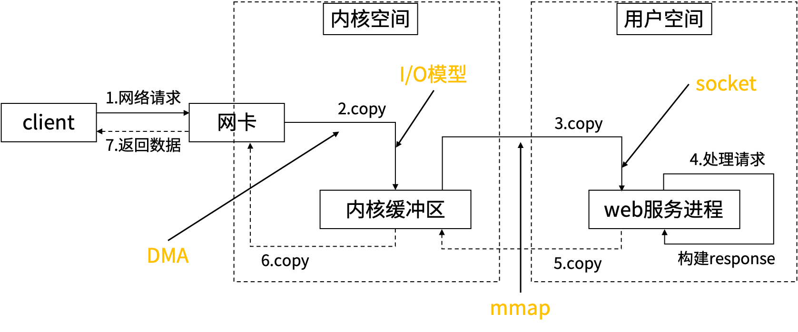
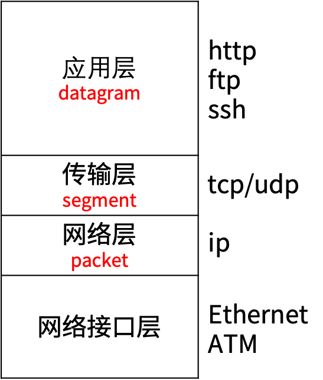

# socket编程
## 网络通信过程
 
- DMA：网卡和磁盘数据拷贝到内存流程比较固定，不涉及到运算操作，且非常耗时。在磁盘嵌入一个DMA芯片，完成上述拷贝工作，把CPU解脱出来，让CPU专注于运算。
- mmap：用户空间和内核空间映射同一块内存空间，从而达到省略将数据从内核缓冲区拷贝到用户空间的操作，用户空间通过映射直接操作内核缓冲区的数据。  

阻塞式网络I/O  

  

非阻塞式网络I/O  

  

多路复用网络I/O  


&#8195;&#8195;socket把复杂的传输层协议封装成简单的接口，使应用层可以像读写文件一样进行网络数据的传输。  

  

socket通信过程  


## TCP CS架构
### 网络通信模型
OSI参考模型  

  

TCP/IP模型  

  
&#8195;&#8195;传输层数据大小的上限为MSS(Maximum Segment Size, 最大分段大小)，网络接口层数据大小的上限为MTU(Maximum Transmit Unit, 最大传输单元)。  
### TCP协议解读
&#8195;&#8195;MSS=MTU-ip首部-tcp首部，MTU视网络接口层的不同而不同。TCP在建立连接时通常需要协商双方的MSS值。应用层传输的数据大于MSS时需要分段。  
 
TCP首部  
  
- 前20个字节是固定的，后面还4N个可选字节（TCP选项）。
- 数据偏移：TCP数据部分距TCP开头的偏移量（一个偏移量是4个字节， TCP选项占4N个字节），亦即TCP首部的长度。所以TCP首部的最大长度是15*4=60个字节，即TCP选项最多有40个字节。
- 端口在tcp层指定，ip在IP层指定。端口占2个字节，则最大端口号为2^16-1=65535。
- 由于应用层的数据被分段了，为了在接收端对数据按顺序重组，需要为每段数据编个“序号”。
- TCP规定在连接建立后所有传送的报文段都必须把ACK设置为1。  

TCP建立连接  
  
- 第一次握手：TCP首部SYN=1，初始化一个序号=J。SYN报文段不能携带数据。
- 第二次握手：TCP首部SYN=1，ACK=1，确认号=J+1，初始化一个序号=K。此报文同样不携带数据。
- 第三次握手：SYN=1，ACK=1，序号=J+1，确认号=K+1。此次一般会携带真正需要传输的数据。
- 确认号：即希望下次对方发过来的序号值。
- SYN Flood 攻击始终不进行第三次握手，属于DDOS攻击的一种。  

TCP释放连接  
  
- TCP的连接是全双工（可以同时发送和接收）的连接，因此在关闭连接的时候，必须关闭传送和接收两个方向上的连接。
- 第一次挥手：FIN=1，序号=M。
- 第二次挥手：ACK=1，序号=M+1。
- 第三次挥手：FIN=1，序号=N。
- 第四次挥手：ACK=1，序号=N+1。
- 从TIME_WAIT进入CLOSED需要经过2个MSL（Maxinum Segment Lifetime），RFC793建议MSL=2分钟。  
### Go TCP编程
- 用三元给（ip地址，协议，端口号）唯一标示网络中的一个进程，如（172.122.121.111, tcp, 5656）。
- IPv4的地址位数为32位，分为4段，每段最大取值为255。
- IPv6的地址位数为128位，分为8段，各段用16进制表示，最大取值为ffff。
- 端口：0~1023被熟知的应用程序占用（普通应用程序不可以使用），49152~65535客户端程序运行时动态选择使用。
```Go
func ResolveTCPAddr(net, addr string) (*TCPAddr, os.Error)
```
&#8195;&#8195;net参数是“tcp4”、“tcp6”、“tcp”中的任意一个，分别表示TCP（IPv4-only），TCP（IPv6-only）或者TCP（IPv4,、IPv6的任意一个）。addr表示域名或者IP地址，例如" www.qq.com:80" 或者"127.0.0.1:22"。  
```Go
func DialTCP(network string, laddr, raddr *TCPAddr) (*TCPConn, error)
```
&#8195;&#8195;network参数是"tcp4"、"tcp6"、"tcp"中的任意一个。laddr表示本机地址，一般设置为nil。raddr表示远程的服务地址。  
```Go
func net.DialTimeout(network string, address string, timeout time.Duration) (net.Conn, error)
```
&#8195;&#8195;创建连接时设置超时时间。 
```Go
func (*net.conn) Write(b []byte) (int, error)
```
&#8195;&#8195;通过conn发送数据。  
```Go
func (net.Conn).Read(b []byte) (n int, err error)
```
&#8195;&#8195;从conn里读取数据，如果没有数据可读，会阻塞。  
```Go
func ioutil.ReadAll(r io.Reader) ([]byte, error)
```
&#8195;&#8195;从conn中读取所有内容，直到遇到error(比如连接关闭)或EOF。  
```Go
func ListenTCP(network string, laddr *TCPAddr) (*TCPListener, error)
```
&#8195;&#8195;监听端口。  
```Go
func (l *TCPListener) Accept() (Conn, error)
```
&#8195;&#8195;阻塞，直到有客户端请求建立连接。  
```Go
func (*net.conn) Close() error
```
&#8195;&#8195;关闭连接。 
```Go
func (c *TCPConn) SetReadDeadline(t time.Time) error 
func (c *TCPConn) SetWriteDeadline(t time.Time) error
```
&#8195;&#8195;设置从一个tcp连接上读取和写入的超时时间。  
```Go
func (c *TCPConn) SetKeepAlive(keepalive bool) os.Error
```
&#8195;&#8195;当一个tcp连接上没有数据时，操作系统会间隔性地发送心跳包，如果长时间没有收到心跳包会认为连接已经断开。  

tcp_server.go  
```Go
package main

import (
	"encoding/json"
	"fmt"
	"golearn/day011/socket"
	"net"
	"strconv"
	"time"
)

type (
	Request struct {
		A int
		B int
	}
	Response struct {
		Sum int
	}
)

func handleRequest2(conn net.Conn) {
	conn.SetReadDeadline(time.Now().Add(30 * time.Second)) //30秒后conn.Read会报出i/o timeout
	defer conn.Close()
	for { //长连接，即连接建立后进行多轮的读写交互
		requestBytes := make([]byte, 256) //初始化后byte数组每个元素都是0
		read_len, err := conn.Read(requestBytes)
		if err != nil {
			fmt.Printf("read from socket error: %s\n", err.Error())
			break //到达deadline后，退出for循环，关闭连接。client再用这个连接读写会发生错误
		}
		fmt.Printf("receive request %s\n", string(requestBytes)) //[]byte转string时，0后面的会自动被截掉

		var request socket.Request
		json.Unmarshal(requestBytes[:read_len], &request) //json反序列化时会把0都考虑在内，所以需要指定只读前read_len个字节
		response := socket.Response{Sum: request.A + request.B}

		responseBytes, _ := json.Marshal(response)
		_, err = conn.Write(responseBytes)
		socket.CheckError(err)
		fmt.Printf("write response %s\n", string(responseBytes))
	}
}

//长连接
func main() {
	ip := "127.0.0.1" //ip换成0.0.0.0和空字符串试试
	port := 5656
	tcpAddr, err := net.ResolveTCPAddr("tcp4", ip+":"+strconv.Itoa(port))
	socket.CheckError(err)
	listener, err := net.ListenTCP("tcp4", tcpAddr)
	socket.CheckError(err)
	fmt.Println("waiting for client connection ......")
	for {
		conn, err := listener.Accept()
		if err != nil {
			continue
		}
		fmt.Printf("establish connection to client %s\n", conn.RemoteAddr().String()) //操作系统会随机给客户端分配一个49152~65535上的端口号
		go handleRequest2(conn)
	}
}
```
tcp_client.go  
```Go
package main

import (
	"encoding/json"
	"fmt"
	"golearn/day011/socket"
	"net"
	"strconv"
	"time"
)

//长连接
func main() {
	ip := "127.0.0.1" //ip换成0.0.0.0和空字符串试试
	port := 5656
	conn, err := net.DialTimeout("tcp4", ip+":"+strconv.Itoa(port), 30*time.Minute)
	socket.CheckError(err)
	fmt.Printf("establish connection to server %s\n", conn.RemoteAddr().String())
	defer conn.Close()
	for { //长连接，即连接建立后进行多轮的读写交互
		request := socket.Request{A: 7, B: 4}
		requestBytes, _ := json.Marshal(request)
		_, err = conn.Write(requestBytes)
		socket.CheckError(err)
		fmt.Printf("write request %s\n", string(requestBytes))
		responseBytes := make([]byte, 256) //初始化后byte数组每个元素都是0
		read_len, err := conn.Read(responseBytes)
		socket.CheckError(err)
		var response socket.Response
		json.Unmarshal(responseBytes[:read_len], &response) //json反序列化时会把0都考虑在内，所以需要指定只读前read_len个字节
		fmt.Printf("receive response: %d\n", response.Sum)
		time.Sleep(1 * time.Second)
	}
}
```
## UDP CS架构
### UDP协议解读
  
- UDP首部占8个字节，所以UDP报文长度最小是8B。  
- 不需要建立连接，直接收发数据，效率很高
- 面向报文。对应用层交下来的报文，既不合并也不拆分，直接加上边界交给IP层。TCP是面向字节流，TCP有一个缓冲，当应用程序传送的数据块太长，TCP就可以把它划分短一些再传送；如果应用程序一次只发送一个字节，TCP也可以等待积累有足够多的字节后再构成报文段发送出去。
- 从机制上不保证顺序（在IP层要对数据分段），可能会丢包（检验和如果出差错就会把这个报文丢弃掉）。在内网环境下分片乱序和数据丢包极少发生。
- 支持一对一、一对多、多对一和多对多的交互通信。
### Go UDP编程
```Go
func net.Dial(network string, address string) (net.Conn, error)
```
&#8195;&#8195;netwok指定为udp，建立udp连接（伪连接）。  
```Go
func net.DialTimeout(network string, address string, timeout time.Duration) (net.Conn, error)
```
&#8195;&#8195;netwok指定为udp，建立连接时指定超时。  
```Go
func net.ResolveUDPAddr(network string, address string) (*net.UDPAddr, error)
```
&#8195;&#8195;解析成udp地址。  
```Go
func net.ListenUDP(network string, laddr *net.UDPAddr) (*net.UDPConn, error)
```
&#8195;&#8195;直接调用Listen就返回一个udp连接。  
```Go
func (*net.UDPConn).ReadFromUDP(b []byte) (int, *net.UDPAddr, error)
```
&#8195;&#8195;读数据，会返回remote的地址。  
```Go
func (*net.UDPConn).WriteToUDP(b []byte, addr *net.UDPAddr) (int, error)
```
&#8195;&#8195;写数据，需要指定remote的地址。  
udp_server.go  
```Go
package main

import (
	"encoding/json"
	"fmt"
	"golearn/day011/socket"
	"net"
	"strconv"
	"time"
)

//长连接
func main() {
	ip := "127.0.0.1" //ip换成0.0.0.0和空字符串试试
	port := 5656
	udpAddr, err := net.ResolveUDPAddr("udp", ip+":"+strconv.Itoa(port))
	socket.CheckError(err)
	conn, err := net.ListenUDP("udp", udpAddr) //UDP不需要创建连接，所以不需要像TCP那样通过Accept()创建连接，这里的conn是个假连接
	socket.CheckError(err)
	conn.SetReadDeadline(time.Now().Add(30 * time.Second))
	defer conn.Close()
	for {
		requestBytes := make([]byte, 256)                           //初始化后byte数组每个元素都是0
		read_len, remoteAddr, err := conn.ReadFromUDP(requestBytes) //一个conn可以对应多个client，ReadFrom可以返回是哪个
		if err != nil {
			fmt.Printf("read from socket error: %s\n", err.Error())
			break //到达deadline后，退出for循环，关闭连接。client再用这个连接读写会发生错误
		}
		fmt.Printf("receive request %s from %s\n", string(requestBytes), remoteAddr.String()) //[]byte转string时，0后面的会自动被截掉

		var request socket.Request
		json.Unmarshal(requestBytes[:read_len], &request) //json反序列化时会把0都考虑在内，所以需要指定只读前read_len个字节
		response := socket.Response{Sum: request.A + request.B}

		responseBytes, _ := json.Marshal(response)
		_, err = conn.WriteToUDP(responseBytes, remoteAddr) //由于UDP conn支持多对多通信，所以通信对方可能有多个EndPoint，通过WriteTo指定要写给哪个EndPoint
		socket.CheckError(err)
		fmt.Printf("write response %s to %s\n", string(responseBytes), remoteAddr.String())
	}
}
```
udp_client.go  
```Go
package main

import (
	"encoding/json"
	"fmt"
	"golearn/day011/socket"
	"net"
	"strconv"
	"sync"
	"time"
)

//长连接
func main() {
	ip := "127.0.0.1" //ip换成0.0.0.0和空字符串试试
	port := 5656
	//跟tcp_client的唯一区别就是这行代码
	conn, err := net.DialTimeout("udp", ip+":"+strconv.Itoa(port), 30*time.Minute) //一个conn绑定一个本地端口
	socket.CheckError(err)
	defer conn.Close()
	const P = 10
	wg := sync.WaitGroup{}
	wg.Add(P)
	for i := 0; i < P; i++ {
		request := socket.Request{A: 7, B: 4}
		requestBytes, _ := json.Marshal(request)
		go func() { //多协程，共用一个conn
			defer wg.Done()
			for { //长连接，即连接建立后进行多轮的读写交互
				_, err = conn.Write(requestBytes)
				socket.CheckError(err)
				fmt.Printf("write request %s\n", string(requestBytes))
				responseBytes := make([]byte, 256) //初始化后byte数组每个元素都是0
				read_len, err := conn.Read(responseBytes)
				socket.CheckError(err)
				var response socket.Response
				json.Unmarshal(responseBytes[:read_len], &response) //json反序列化时会把0都考虑在内，所以需要指定只读前read_len个字节
				fmt.Printf("receive response: %d\n", response.Sum)
				time.Sleep(1 * time.Second)
			}
		}()
	}
	wg.Wait()
}
```
&#8195;&#8195;由于UDP不需要建立连接，所以通过Dial()创建的是一个虚拟连接， Dial()总是会立即返回成功，即使对方还没有准备好。所以UDP可以先启client，再启server。由于是虚拟连接所以多个client可以共用一个conn，所以Server端往conn里写数据时需要指定写给哪个client，同理从conn里读数据会返回client的Address，即WriteToUDP (b []byte, addr *net.UDPAddr)和ReadFromUDP(b []byte) (int, *net.UDPAddr, error)。由于UDP是无连接和，对方关闭连接后，本方再在conn上调用Write和Read不会报错。    
&#8195;&#8195;应用层的一条完整数据称为报文。TCP是面向字节流的，一次Read到的数据可能包含了多个报文，也可能只包含了半个报文，一条报文在什么地方结束需要通信双方事先约定好。UDP是面向报文的，一次Read只读一个报文，如果没有把一个报文读完，后面的内容会被丢弃掉，下次就读不到了。  