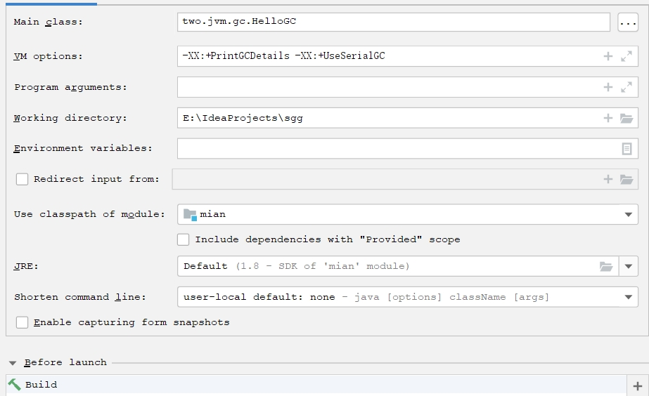

###jvm的参数类型
    标配参数
        -version
        -help
        -showversion
    X参数
        -Xint 解释执行
        -Xcomp  第一次使用就编译成本地代码
        -Xmixed 混合模式
    XX参数
        Boolean类型
            公式：
                -XX:+ 或者 - 某个属性值
                +表示开启
                -表示关闭
            Case：
                设置打印GC收集细节
                    VM options中添加
                    -XX:+PrintGCDetails
                查看是否打印GC收集细节
                    jinfo -flag PrintGCDetails 进程号
                设置运行参数
                
        KV设值类型
            公式：
                -XX:属性key=属性value
            Case：
                -XX:MetaspaceSize=128m
                -XX:MaxTenuringThreshold=15
                -Xms等价于-XX:InitialHeapSize
                -Xmx等价于-XX:MaxHeapSize
        jinfo举例，如何查看当前运行程序的配置
                
###查看JVM参数默认值
    :=表示值被修改过
    =表示值没被修改过

    -XX:+PrintFlagsInitial  初始值
        java -XX:+PrintFlagsInitial
    -XX:+PrintFlagsFinal    最终使用的
        java -XX:+PrintFlagsFinal -version
    -XX:+PrintCommandLineFlags
        java -XX:+PrintCommandLineFlags -version